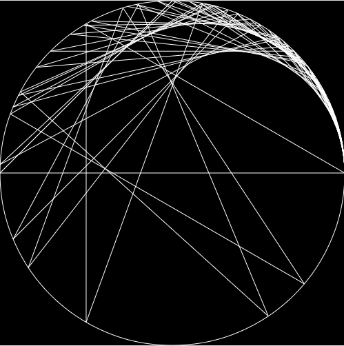
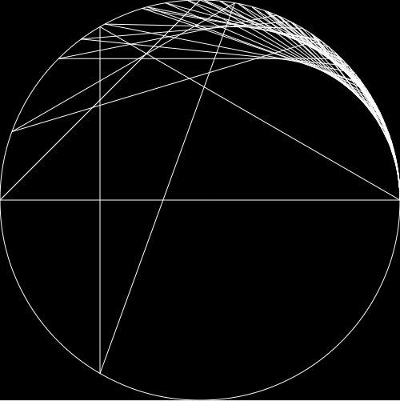

# Times Table Cardioid
The Collatz conjecture is one of the most famous unsolved problems in mathematics. The conjecture asks whether repeating two simple arithmetic operations will eventually transform every positive integer into 1.

### Examples:
1. 6322

---
2. 6171

references: 

[Mathologer: Times Table Cardioid(Video)](https://www.youtube.com/watch?v=qhbuKbxJsk8)

[Daniel Shiffman: Times Table Cardioid(Coding Challenge)](https://thecodingtrain.com/challenges/133-time-tables-cardioid-visualization)
