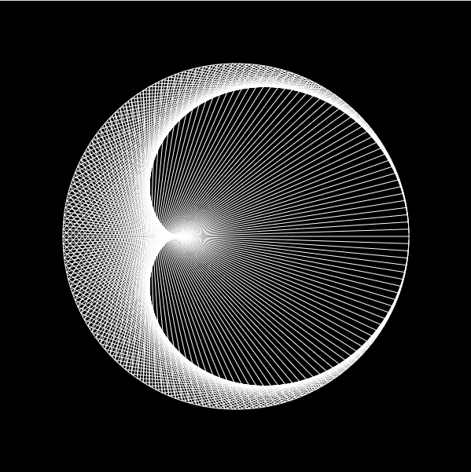
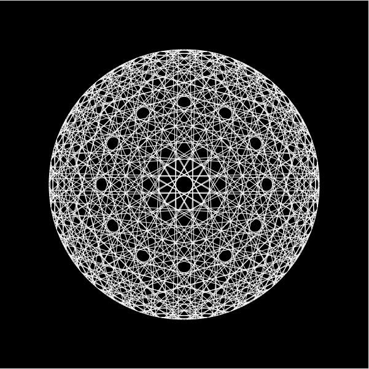
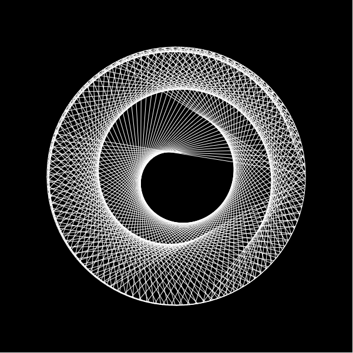

# Times Table Cardioid
A cardioid can also be defined as the set of points of reflections of a fixed point on a circle through all tangents to the circle.

**Live at:** [techishant.github.io/p5-visualisations/TimesTableCardioid](https://techishant.github.io/p5-visualisations/TimesTableCardioid)

### Examples:
1. 2

---
2. 73

---
3. 400.89

references: 

[Mathologer: Times Table Cardioid(Video)](https://www.youtube.com/watch?v=qhbuKbxJsk8)

[Daniel Shiffman: Times Table Cardioid(Coding Challenge)](https://thecodingtrain.com/challenges/133-time-tables-cardioid-visualization)
