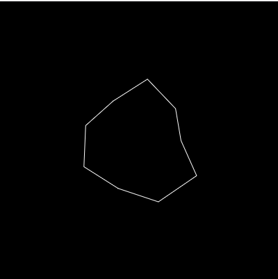
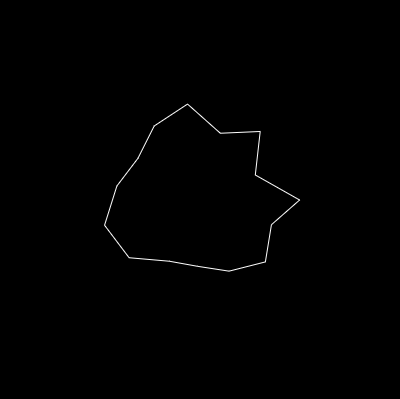

# Random Asteroid Generator (sine)
This use trignometrical function to generate random asteriods

**Live at:** [techishant.github.io/p5-visualisations/asteroids](https://techishant.github.io/p5-visualisations/asteroids)

### Examples:
1. 

---
2. 

