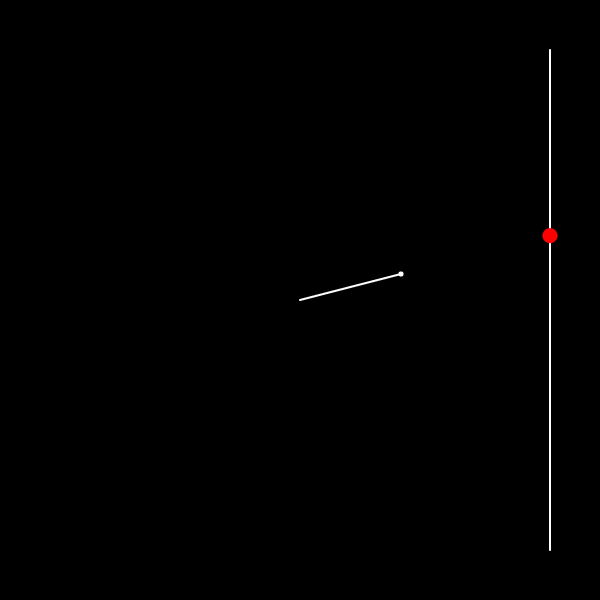
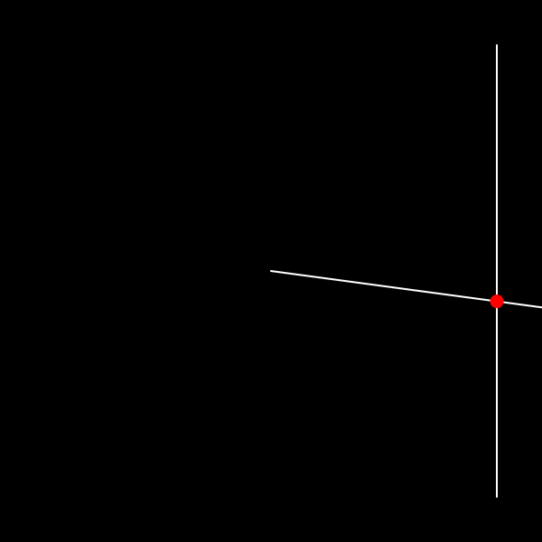

# Line-Line Intersection
In Euclidean geometry, the intersection of a line and a line can be the empty set, a point, or another line. Distinguishing these cases and finding the intersection have uses, for example, in computer graphics, motion planning, and collision detection.

**Live at:** [techishant.github.io/p5-visualisations/lineLineIntersection](https://techishant.github.io/p5-visualisations/lineLineIntersection)

references: 

[en.wikipedia.org/wiki/Line–line_intersection](https://en.wikipedia.org/wiki/Line%E2%80%93line_intersection)
